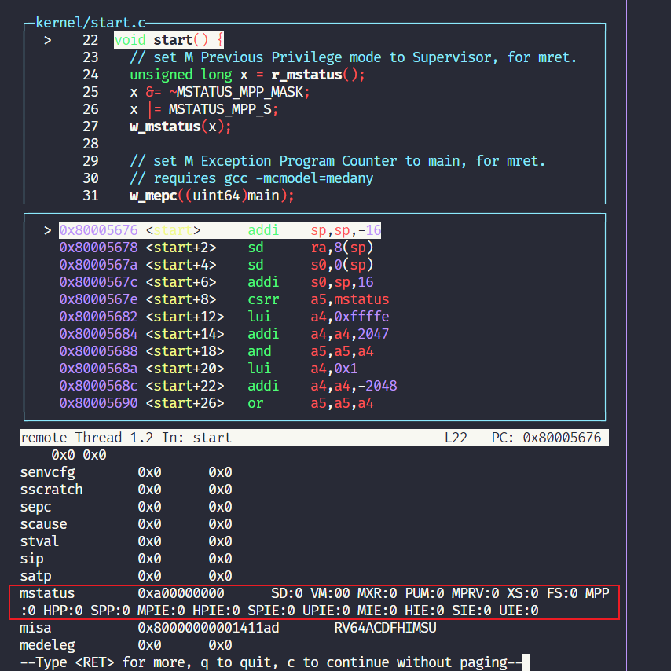

## 启动 xv6

通过 GDB 调试 xv6 的启动过程，启动后断点打到 `_entry`，可以看到最终断点会在 `0x8000000a`，执行指令 `csrr    a1,mhartid`，读取状态控制寄存器的值并存储在 `a1` 中。


从 `_entry` 进入到 `start()`，通过指令 `i all-r` 查看 `mstatus` 寄存器，各个位上有不同的含义。




在 `start()` 中首先会修改 `mstatus`，这个关联到特权等级的寄存器。然后在一系列操作后通过内联汇编切换到 `main()`。

在 `main()` 中首先会执行 `consoleinit()`，其次是 `printfinit()`，然后显示内核启动，接下来的函数用来做初始化：

- `kinit()`：设置页表分配器
- `kvminit()`：设置虚拟内存
- `kvminithart()`：打开页表
- `processinit()`：设置初始进程或者说设置进程表单
- `trapinit()`/`trapinithart()`：设置用户态与内核态的转换代码
- `plicinit()`/`plicinithart()`：设置好中断控制器 PLIC（Platform Level Interrupt Controller），应该是用来和磁盘做 I/O 操作的
- `binit()`：分配 buffer 缓存
- `iinit()`：初始化 inode 缓存
- `fileinit()`：初始化文件系统，这里好像是 `xv6/mkfs/mkfs.c`
- `virtio_disk_init()`：初始化磁盘，磁盘文件好像是 `xv6/fs.img`
- `userinit()`：第一个进程

在 `kernel/proc.c/userinit()` 这个进程中可以看到**系统调用的过程**。


`initcode` 具体可见 `user/initcode.S`，其中有一段：

```assembly
.globl start
start:
        la a0, init
        la a1, argv
        li a7, SYS_exec
        ecall
```

这里有一个 `li a7, SYS_exec`，将 `SYS_exec` 加载到 `a7`，再通过 `ecall` 回到内核态，执行系统调用。

> 大致讲过，系统调用实际上，在我的理解上是说，用户程序的 `exec()` 等函数，通过将 `SYS_exec` 这样的调用值作为参数，调用 `ecall` 指令跳转到内核态。进入内核态会有一个 `syscall()` 函数通过 `ecall` 带入的参数（例如 `SYS_exec` 这些的调用值）来执行真正的系统调用的函数
>
> 如 `SYS_exec` 等调用值在 `kernel/syscall.h` 中

执行 `syscall()` 时，会定义一个 `int` 类型的变量 `num`，读取之前被加载到 `a7` 中的参数，作为依据来进行内核态中的系统调用。


在 `syscalls [num]() `可以得到实际上执行的系统调用：


并跳转到相应的函数中，这里是跳转到 `kernel/sysfile.c/sys_exec()` 中：


通过 `exec` 实际上会执行 `init`，也就是说，`initcode` 通过 `exec` 调用了 `init`。`init` 会为用户空间做一些配置，最终启动 `sh`。

## 系统调用时干啥了

1. 通过 `user/usys.py` 生成的 `user/usys.S`，保存调用号到 `a7`，保存用户态数据（例如参数存入 `a0` 等寄存器），通过 `ecall` 切换到内核态；
2. `kernel/syscall.c/syscall()` 读取 `a7` 中的调用号，通过 `syscalls [num]() `转入相关系统调用的内核级实现；
3. 通过一些寄存器（`a0` 等）读取用户使用系统调用时的参数，完成相关操作。
