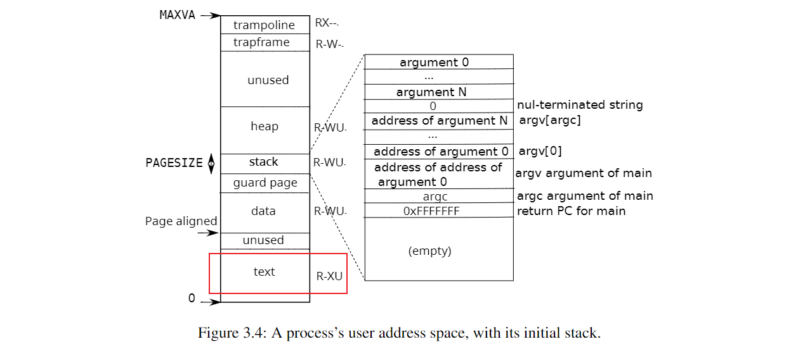
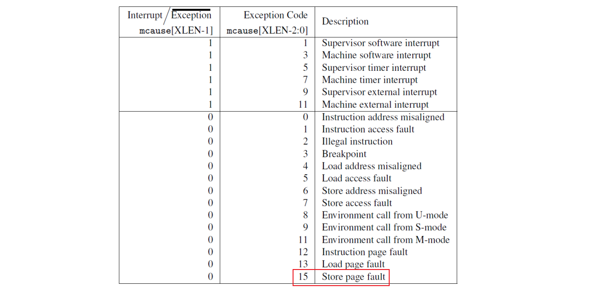

## fork() 的缺点

在日常的 Linux 编程中，一般会通过 `fork()` 创建一个新进程，分为父子进程来处理逻辑；或者在子进程中通过 `exec()` 来加载一个新程序，shell 启动新程序就是这样操作的。在执行 `fork()` 时，子进程会完全拷贝父进程，包括其执行代码段、数据段、栈和堆，并在接下来的处理过程中修改数据段等内存空间中的数据，而不影响另一个进程。

然而这样的直接拷贝，对于内存来说是一种浪费。执行 `fork()` 后子进程可能只是简单的执行了一些动作；或者直接调用 `exec()` 将新程序替换到代码段，重新初始化数据段和堆栈。那 `fork()` 时的完整拷贝又有什么意义呢？

## Copy on write

基于以上以及其他缘由，开发者们提出了「Copy ont write」机制。

在 COW 机制之前，执行 `fork()` 后会在 kernel 中初始化子进程的数据结构，并逐页复制父进程的物理页块的内容到自己的页块上，并在页表中将虚拟地址映射到物理地址上。

而 COW 机制不会逐页复制父进程的物理页块，而是直接在页表中将虚拟地址映射到父进程的物理地址上，即父子进程共享同一物理地址。同时将物理页块设置为不可读，防止某一进程修改影响到其他进程。当某一个进程需要修改内存空间时怎么办呢？因为进程尝试写一个不可写的物理页块，会触发 Store page fault，可以通过检查物理页块的标志位，确定它是一个 COW 页块，那么就拷贝其内容到一个新申请的物理页块上，将这个新的物理页块映射到需要修改内存的进程中，供其使用。这样父子进程就不会相互影响。

当多个进程使用同一物理页块时，可以通过维护一个引用计数数组，来确定释放物理页块时是假释放还是真销毁。

这种方式避免了无意义的拷贝工作，而是将真正有『价值』的拷贝工作延后到需要的时候，避免了浪费。

## 结合 COW 的 fork() 实现

### 创建新进程

首先，可以在 `kernel/kalloc.c` 中维护一个引用计数数组，来确定每个物理页块的引用数，同时也需要引入一个锁来保障原子性。`cowcount()` 则完成对这个计数数组的操作，当标志位 `flag` 大于 0 时表示为计数数组 +1，小于 0 时表示 -1，等于 0 时只返回对应地址的计数。

在 `kernel/risc.h` 中定义了用于表示 COW 页块的 PTE 标志位。在 `kernel/memlayout.h` 中定义了表示引用计数数组长度的 `COWCOUNTSZ`，和用于计算物理地址对应数组索引的 `COWCOUNT(pa)`，这里的 `pa` 指物理页块的首地址。

考虑到 `kernel/param.h` 中通过 `NPROC` 来定义 xv6 中进程的最大数量，引用计数数组使用 `char` 类型即可，节省了内存空间。

```c
// kernel/risc.h
#define PTE_COW (1L << 8)

// kernel/memlayout.h
#define COWCOUNTSZ   ((PHYSTOP - KERNBASE) / PGSIZE)
#define COWCOUNT(pa) (((uint64)(pa)-KERNBASE) / PGSIZE)

// kernel/kalloc.c
struct {
  struct spinlock lock;
  char count[COWCOUNTSZ];
} cowcounts;

char cowcount(uint64 pa, int flag) {
  char count = 0;

  acquire(&cowcounts.lock);
  if (flag > 0) {
    cowcounts.count[COWCOUNT(pa)]++;
  } else if (flag < 0) {
    cowcounts.count[COWCOUNT(pa)]--;
  }
  count = cowcounts.count[COWCOUNT(pa)];
  release(&cowcounts.lock);

  return count;
}
```

对于未使用的物理页块，其引用计数为 0，当通过 `kalloc()` 申请一个新的物理页块时，会将其对应的引用计数设置为 1。

```c
// kernel/kalloc.c
void *kalloc(void) {
  struct run *r;

  acquire(&kmem.lock);
  r = kmem.freelist;
  if (r) {
    kmem.freelist = r->next;
  }
  release(&kmem.lock);

  if (r) {
    memset((char *)r, 5, PGSIZE);
    cowcount((uint64)r, 1);
  }

  return (void *)r;
}
```

追踪 xv6 源代码可以看到，执行 `fork()` 时会调用 `uvmcopy()` 来拷贝父进程的内存空间给子进程并映射到其页表上。当使用 COW 机制时，需要舍弃拷贝页面的操作，转而直接在子进程的页表上将虚拟地址映射到父进程的物理页块上，同时为物理页块的引用计数 +1。

```c
// kernel/vm.c
int uvmcopy(pagetable_t old, pagetable_t new, uint64 sz) {
  pte_t *pte;
  uint64 pa, i;
  uint flags;

  for (i = 0; i < sz; i += PGSIZE) {
    if ((pte = walk(old, i, 0)) == 0) {
      panic("uvmcopy: pte should exist");
    }
    if ((*pte & PTE_V) == 0) {
      panic("uvmcopy: page not present");
    }

    pa = PTE2PA(*pte);
    if (*pte & PTE_W) {
      *pte &= ~PTE_W;
      *pte |= PTE_COW;
    }
    cowcount(pa, 1);
    flags = PTE_FLAGS(*pte);
    if (mappages(new, i, PGSIZE, (uint64)pa, flags) != 0) {
      // 由于之前增加过计数器，映射失败需要释放一个计数器
      kfree((void *)pa);
      goto err;
    }
  }
  return 0;

err:
  uvmunmap(new, 0, i / PGSIZE, 1);
  return -1;
}
```

值得注意的是，Lab 的单元测试中会涉及到对 text segment 的修改。而参考 xv6 的进程内存模型，可以看到 text segment 属于只读，如果对它加上 `PTE_COW` 标志，则在单元测试中会报错，所以只修改可写页，为其加上 `PTE_COW` 标志。



### 需要修改内存

当一个进程需要修改内存时，修改不可写的物理页块会触发 Store page fault，在 `kernel/trap.c` 的 `usertrap()` 则可以捕获这个 page fault，并完成 COW 机制的 copy 操作。

首先需要在 `usertrap()` 中捕获 Store page fault，通过 `r_scause()` 读取 scause 寄存器，获取状态码，15 表示 Store page fault，其他状态码如图所示。并通过 `r_stval()` 获取发生 Store page fault 错误的虚拟地址。然后会调用 `writecowpage()` 来处理 COW 页，如果返回值为 -1 时，将当前进程杀死。



```c
// kernel/trap.c
void usertrap(void) {
  // ...
  if (r_scause() == 8) {
    // system call
  } else if (r_scause() == 15) {
    // Store page fault
    uint64 va = r_stval();

    if (va > p->sz) {
      printf("Error: The virtual address greater then this process's size\n");
      p->killed = 1;
    } else if (writecowpage(p->pagetable, va) != 0) {
      printf("Error: This page is not a cow-page or xv6 don't have enouth page, so not allow to write\n");
      p->killed = 1;
    }
  }
  // ...
}
```

在 `writecowpage()` 中，会根据虚拟地址映射的物理页块，确定其引用计数。如果大于 1，说明有多个进程共享这个物理页块，那么需要拷贝其内容到一个新申请的物理页块上，交由进程修改；如果等于 1，说明只有一个进程使用这个物理页块，那么直接修改其标志位，允许写即可。

通过 `uvmunmap()` 可以将原来的物理地址取消映射，在 `uvmunmap()` 中调用 `kfree()` 减少引用计数；并通过 `mappages()` 将虚拟地址映射到新申请的物理页块上。

```c
// kernel/trap.c
int writecowpage(pagetable_t pagetable, uint64 va) {
  va = PGROUNDDOWN(va);
  pte_t *pte = walk(pagetable, va, 0);
  if (pte == 0) {
    panic("COW: fail to get pte");
  }

  uint flags = PTE_FLAGS(*pte);
  if (!(flags & PTE_COW)) {
    // this page is not a cow page
    printf("COW: This page from %p is not a cow page\n", va);
    return -1;
  }

  uint64 pa = PTE2PA(*pte);
  if (cowcount(pa, 0) > 1) {
    char *mem = 0;
    flags |= PTE_W;
    flags &= ~PTE_COW;

    if ((mem = kalloc()) == 0) {
      printf("COW: fail to kalloc, kill current process\n");
      // 如果没有足够的页面则杀死进程
      return -1;
    }

    memmove(mem, (char *)pa, PGSIZE);
    uvmunmap(pagetable, va, 1, 1);
    if (mappages(pagetable, va, PGSIZE, (uint64)mem, flags) != 0) {
      printf("COW: fail to mappages\n");
      kfree(mem);
      return -1;
    }
  } else {
    *pte |= PTE_W;
    *pte &= ~PTE_COW;
  }

  return 0;
}
```

在 `copyout()` 中，也需要考虑用户内存映射到的物理页块是不是 COW 页块，如果是的话也需要调用 `writecowpage()` 来实现 copy。

```c
// kernel/vm.c
int copyout(pagetable_t pagetable, uint64 dstva, char *src, uint64 len) {
  uint64 n, va0, pa0;

  while (len > 0) {
    va0 = PGROUNDDOWN(dstva);
    pa0 = walkaddr(pagetable, va0);
    if (pa0 == 0) {
      return -1;
    }

    if (cowcount(pa0, 0) > 1) {
      writecowpage(pagetable, va0);
      pa0 = walkaddr(pagetable, va0);
    }

    n = PGSIZE - (dstva - va0);
    if (n > len) {
      n = len;
    }
    memmove((void *)(pa0 + (dstva - va0)), src, n);

    len -= n;
    src += n;
    dstva = va0 + PGSIZE;
  }
  return 0;
}
```

### 销毁

当一个进程结束，或者触发 Store page fault 并取消原有映射时，会调用 `kfree()` 来『释放』物理页块，是假释放还是真销毁，取决于物理页块的引用计数。当没有其他进程共享物理页块时，调用 `kfree()` 会彻底销毁这个物理页块并归入`freelist`；否则只是减少引用计数，做假释放。

```c
// kernel/kalloc.c
void kfree(void *pa) {
  struct run *r;

  if (((uint64)pa % PGSIZE) != 0 || (char *)pa < end || (uint64)pa >= PHYSTOP) {
    panic("kfree");
  }

  // 首先减少引用计数
  // 引用计数为 0 则表示最后一个进程释放了这个 page
  if (cowcount((uint64)pa, -1) != 0) {
    return;
  }

  // Fill with junk to catch dangling refs.
  memset(pa, 1, PGSIZE);

  r = (struct run *)pa;

  acquire(&kmem.lock);
  r->next = kmem.freelist;
  kmem.freelist = r;
  release(&kmem.lock);
}
```

## 实验后记

实际上 COW Lab 的相关概念很简单，清晰易懂，但是真上手了去实现又是另一种难度，需要注意非常多的细节，做好规划。

但实际上用时颇长，都是下班后的闲暇时间进行，但绝大多数时间都是在摸鱼划水。果然上班跟上学的感觉还是不一样，上了一天班回来只想瘫着，根本没有什么心思继续学习。这样不好，不好。

现在正瘫在出租屋的椅子上码这篇记录，码不动了，有种莫名其妙的心累。
