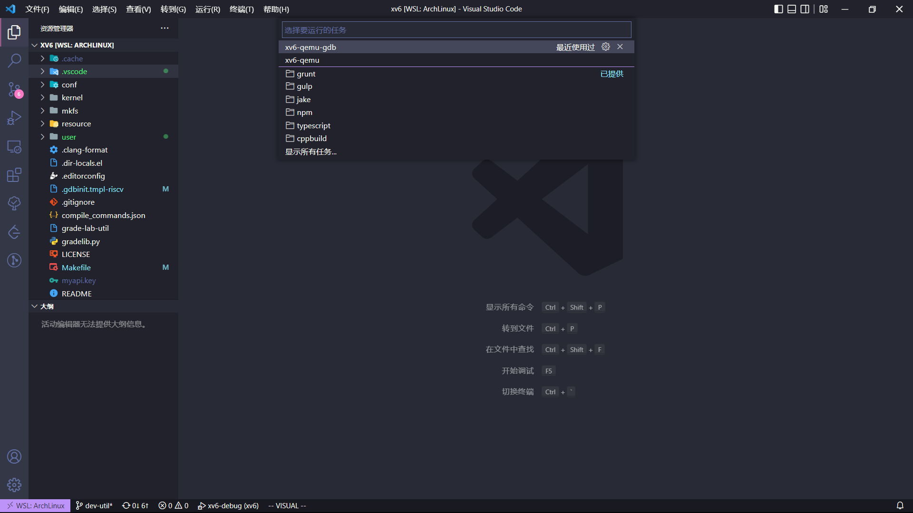
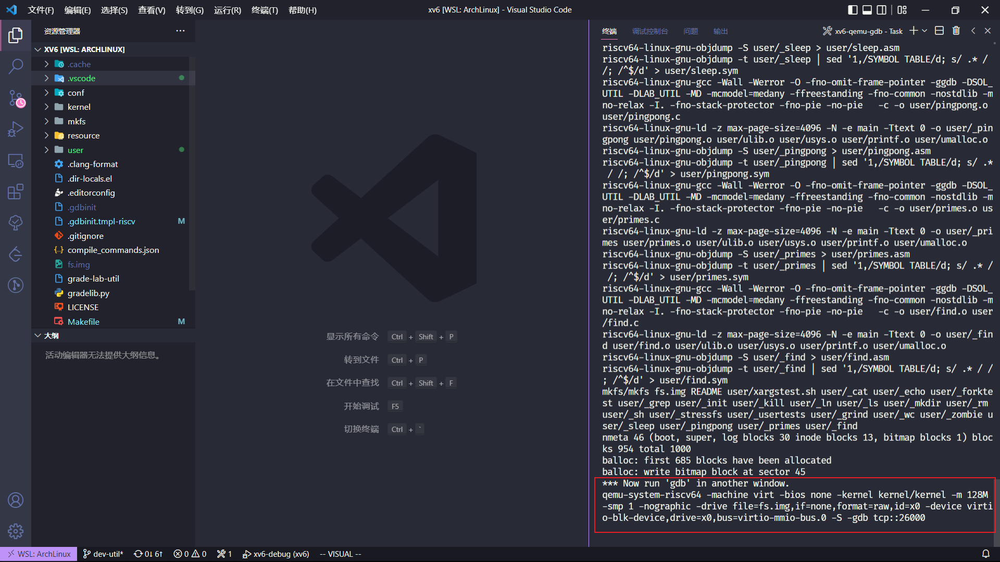
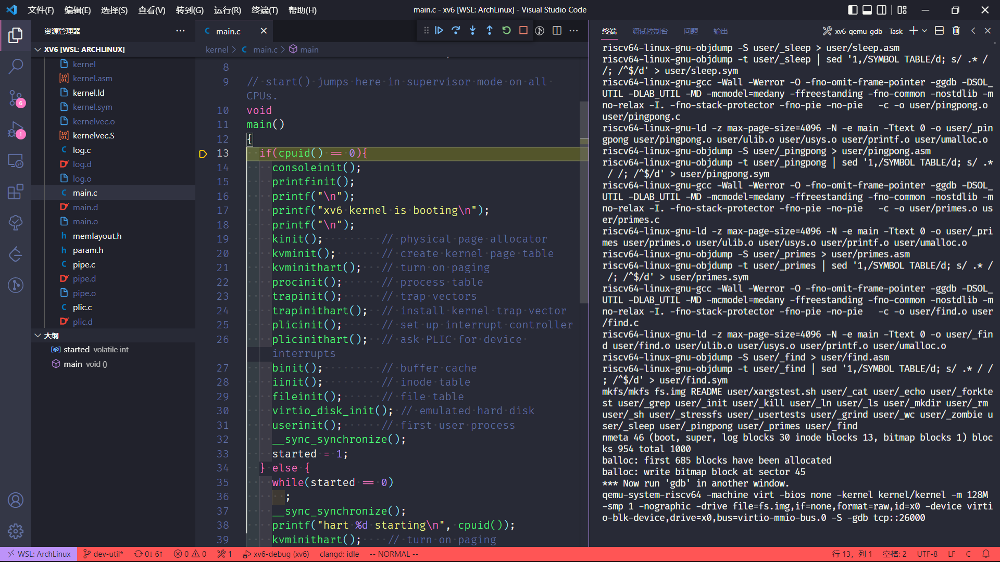
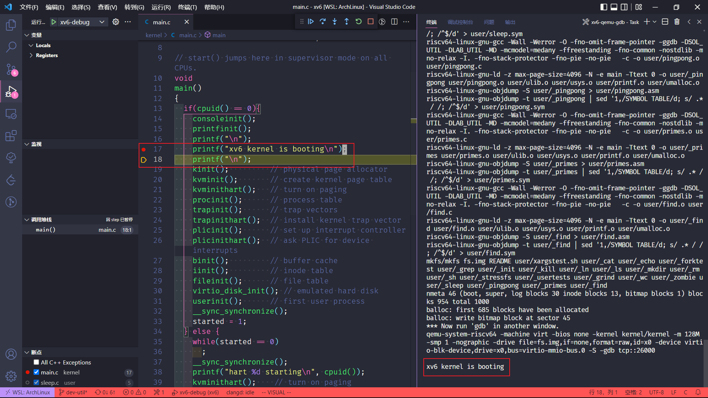
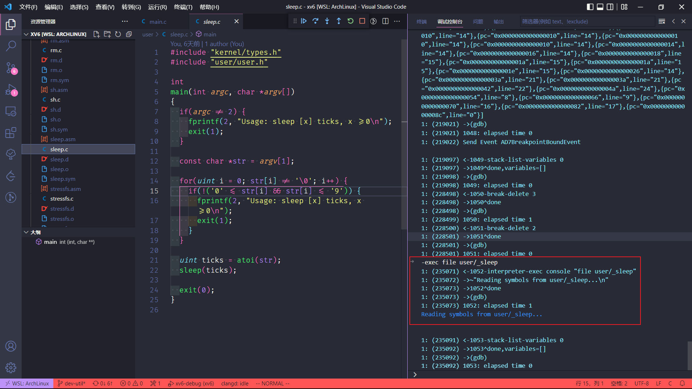
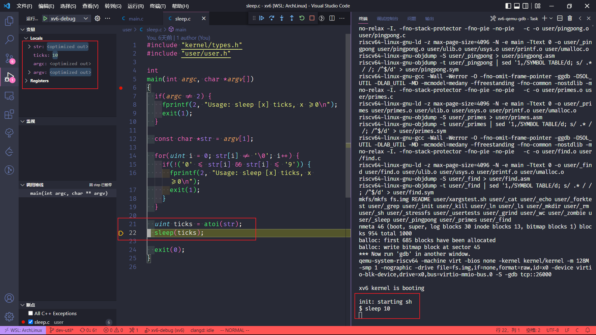

## 通过 vscode 调试 sleep

### 准备配置文件

想要通过 vscode 对 xv6 进行 debug，需要设置配置文件。关于 debug 的配置文件是 `launch.json`，关于运行的配置文件是 `tasks.json`。

关于运行，平常用到的就是 `make qemu` 和 `make qemu-gdb` 两条编译运行指令。通过 `tasks.json` 配置这两个编译运行指令。为了 debug 时顺利一些，设置为单线程执行。

```json
{
    "version": "2.0.0",
    "tasks": [
        {
            "label": "xv6-qemu",
            "type": "shell",
            "command": "make",
            "args": [
                "qemu"
            ]
        },
        {
            "label": "xv6-qemu-gdb",
            "type": "shell",
            "command": "make",
            "args": [
                "qemu-gdb",
                "CPUS=1"
            ],
            "isBackground": true,
        }
    ]
}
```

关于 debug，需要设置 `launch.json`，这个文件的配置有一些麻烦，笔者也不是非常了解这方面知识，只是大概配置了一番。需要注意的是，xv6 根据 Linux 发行版配置了不同的工具链，笔者使用的是 arch Linux，所以 gdb 使用的是 riscv64-linux-gnu-gdb，需要在 `miDebuggerPath` 中配置具体的 gdb。而 `miDebuggerServerAddress` 中的端口则根据 `.gininit` 中记录的值。

```json
{
    "version": "0.2.0",
    "configurations": [
        {
            "name": "xv6-debug",
            "type": "cppdbg",
            "request": "launch",
            "program": "${workspaceFolder}/kernel/kernel",
            "cwd": "${workspaceFolder}",
            "MIMode": "gdb",
            "miDebuggerPath": "riscv64-linux-gnu-gdb",
            "miDebuggerServerAddress": "localhost:26000",
            "stopAtEntry": true,
            "externalConsole": false,
            "setupCommands": [
                {
                    "description": "为 gdb 启用整齐打印",
                    "text": "-enable-pretty-printing",
                    "ignoreFailures": true
                },
            ],
            "logging": {
                "engineLogging": true,
                "programOutput": true,
            },
        }
    ],
}
```

填好以后修改 `.gdbinit.tmpl-riscv`，对 `target remote` 做注释。

```
set confirm off
set architecture riscv:rv64
# target remote 127.0.0.1:1234
symbol-file kernel/kernel
set disassemble-next-line auto
set riscv use-compressed-breakpoints yes
```

### 调试 kernel

首先，需要执行编译运行指令 `make qemu-gdb`，可以通过终端也可以通过 vscode 配置的任务。我运行了相关的任务：





可以看到已经启动了 debug 环境，接下来需要通过 gdb 链接进去。按下 `F5` 启动 debug：



可以看到进入了 `kernel/kernel` 的调试界面，这时候就可以对其进行调试。在 `printf("xv6 kernel is booting\n");` 处打一个断点，单步执行，最终会在终端中看到执行结果：



### 调试用户程序

有时候需要调试自己写好的用户程序，可以在调试控制台读取对应可执行文件：



可以看到读取了 `user/_sleep`，然后打上断点，并且在终端输入指令 `sleep 10`：



可以看到变量被捕获。

需要注意的是，如果调试的过程中需要输入指令和参数，可以先令用户程序处于运行状态，然后在对应地点打上断点，然后输入，这时程序就会阻塞在断点处，开始调试。
