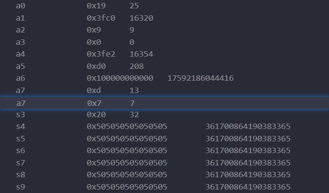

## system call 调用过程

以 `sleep` 为例，追踪整个调用过程。启动 GDB 后，在 `user/sleep.c` 的 `main()` 处打上断点，然后在命令行中输入指令 `sleep 25`，会调用 `user/user.h` 声明的 `sleep()`。


步入后会调用 `user/usys.S`，可以看到 `sleep` 的调用汇编代码。首先将 `SYS_sleep` 的值写入寄存器 `a7`，然后调用 `ecall` 指令陷入内核态，进入真正的 system call，最后通过 `ret` 返回到用户级程序。

> `user/usys.S` 的汇编代码由 `user/usys.pl` 脚本生成。


寄存器 `a7` 可以看到值最终修改为 13，对应了 `kernel/syscall.h` 中 `SYS_sleep` 的值。



调用 `ecall` 会切换到内核态，并调用 `kernel/syscall.c/syscall()`，获取 `a7` 中的调用号，然后根据调用号，在 `*syscalls[]` 中寻找对应的系统调用 `sys_sleep()`。


在找到对应的系统调用 `kernel/sysproc.c/sys_sleep()` 并执行后，会在其中获取保存在寄存器中的参数，并执行真正的实现 `kernel/proc.c/sleep()`。


## 如何实现一个 system call

以即将实现的 `trace()` 为例，描述实现一个 syscall 的具体流程。

首先在 `kernel/syscall.h` 中为新的 syscall 设定一个调用号，一般跟着上一个调用号顺延即可。

```c
// ...
#define SYS_mkdir  20
#define SYS_close  21
#define SYS_trace  22
```

然后在 `user/usys.pl` 脚本中添加一个入口，会在编译生成 `user/usys.S` 时为 `trace()` 生成用户态切换到内核态的汇编代码。

```c
# ...
entry("sleep");
entry("uptime");
entry("trace");
```

如上一节所言，当调用 `ecall` 切换到内核态后，会根据从 `a7` 中取得的调用号来获取对应系统调用的入口，所以需要在 `kernel/syscall.c` 中声明 `sys_trace()` 并添加到 `*syscalls[]` 中。

> 值得一提的是，`kernel/syscall.c` 中也定义了多个用于获取参数的功能函数，在下文中会有使用。

```c
extern uint64 sys_trace(void);

static uint64 (*syscalls[])(void) = {
// ...
[SYS_trace]   sys_trace,
};
```

在 `kernel/sysproc.c` 中需要定义 `sys_trace()` 的实现。`sys_trace()` 不会接受任何参数，那么用户调用时的参数如何获取呢？这就用到上面提到的功能函数，在 `sys_trace()` 中调用它们，从寄存器中获取参数，比如获取一个 `int` 类型参数：

```c
uint64
sys_trace(void) {
  int mask;
  argint(0, &mask);

  // ...
  trace(mask);
  // ...
  
  return 0;
}
```

拿到所需要的参数后，调用 `trace()`，这是系统调用的具体实现，我们定义的功能都在这个函数中实现。

最后记得在 `user/user.h` 中声明用户调用的 `trace()`，在 `kernel/defs.h` 中声明内核调用的 `trace()`。
