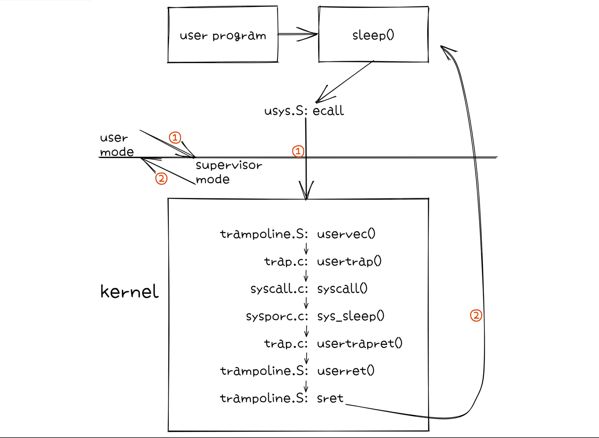

## 何为 trap

当遇到一些事件时，会要求 CPU 从一般代码的执行转移到特殊的事件处理机制，这个机制就是 trap。也可以看作操作系统从用户态陷入内核态。

一般来说有三种情况会触发 trap：

1. system call 通过 ecall 进入内核态；
2. 程序访问越界或访问地址 0；
3. I/O 设备引发中断，例如读写完成。

发生 trap 时，执行流从用户态转移到内核态，保存用户态的状态（寄存器、页表等），在执行完事件处理机制后，再回到用户态程序转移前执行的代码。trap 对于用户态程序来说是透明的，并不知道发生了什么。

## system call 触发 trap

system call 从用户态触发 trap，这里通过一张简单的图给出大致流程：

以用户程序调用 `sleep()` 为例，不会进入具体的 c 函数，而是通过 `usys.S` 中找到相关的入口，保存 `sleep()` 的调用号 `SYS_sleep` 到寄存器 a7，并通过汇编指令 `ecall` 陷入内核态。

当汇编代码中调用 `ecall` 时，首先会从 user mode 转换到 supervisor mode；其次会保存程序计数器 pc 到寄存器 sepc；最后会将 pc 设置成寄存器 stvec 保存的值，stvec 中保存了 trampoline page 的起始地址，这个页块中保存的是 `uservec()` 和 `userret()` 的汇编代码。

在跳转到 trampoline page 后， `uservec()` 会对诸多寄存器做处理。首先将寄存器 a0 的值保存到寄存器 sscratch 中，这样可以在 a0 中填入 `TRAPFRAME`，指向的是 trapframe page 的地址，xv6 会在这个页块中保存用户态下的寄存器。然后会将 trapframe page 保存的前几个值写入寄存器。16(a0) 所保存的是 `struct trapframe` 结构体中的 `kernel_trap`，这里指向了 `trap.c/usertrap()` 的地址。

跳转到 `usertrap()` 后，会获取当前进程的 `struct proc`，并将寄存器 sepc 保存到 `proc->trapframe->epc` 中，防止发生进程调度，覆盖这个寄存器。然后检查寄存器 scause，这个寄存器用于保存发生 trap 的原因的描述号。

system call 的描述号是 8，通过检查后会对 `proc->trapframe->epc + 4`，这是因为 `proc->trapframe->epc` 保存的是用户态中汇编指令 `ecall` 的地址，+4 后指向其下一个汇编指令。

然后通过 `syscall.c/syscall()` 找到 system call `sleep()` 真正的实现函数 `sys_sleep()` 并执行，保存其返回值到 a0 中。

当 system call 执行完成后，就需要从内核态回到用户态，在这之前要恢复环境。调用 `trap.c/usertrapret()`，关中断；变量 `trampoline_uservec` 计算得到 `trampoline.S/uservec()` 的地址，通过内联汇编保存到寄存器 stvec 中，方便下一次 system call 时使用；然后保存 kernel 相关寄存器的值到 `proc->trapframe` 中；变量 `x` 用于修改状态并保存到寄存器 sstatus 中；写入 ecall 下一个汇编指令的地址到寄存器 sepc 中，方便 pc 使用；变量 `satp` 记录用户态页表；变量 `trampoline_userret` 计算得到 `trampoline.S/userret()` 的地址，并以 `satp` 作为参数进行调用。

在 `trampoline.S/userret()` 中，将 trapframe page 中记录的值恢复到寄存器中，汇编指令 `sret` 将寄存器 sepc 中记录的值写入 pc，从 supervisor mode 恢复到 user mode，并开中断。这样就会回到用户程序并继续执行。
